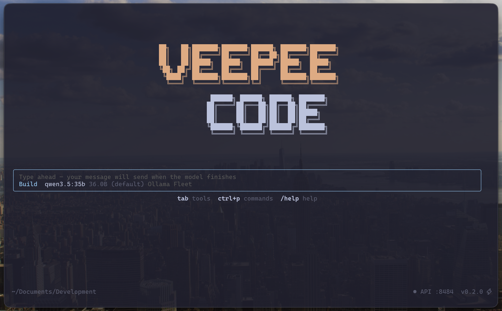

# VEEPEE Code

AI coding assistant powered by your own Ollama fleet — a Claude Code-style CLI with 26 tools, zero API costs, and full data privacy.



## What is it?

VEEPEE Code is a full-screen terminal AI assistant that connects to your own [Ollama](https://ollama.com/) instance (or an [Ollama Fleet Manager](https://github.com/vpontual/llm-traffic-manager) proxy). It gives you a Claude Code-style coding experience with:

- **Zero API cost** — every inference runs on your GPUs
- **Full data privacy** — nothing leaves your network
- **26 integrated tools** — coding, web, devops, home automation, social, productivity
- **Smart model routing** — auto-benchmarks your models and picks the best one per task

## Install

### Prerequisites

- **Node.js 20+**
- **GitHub CLI (`gh`)** — [cli.github.com](https://cli.github.com)
- **Ollama** running on at least one machine

### One-liner

```bash
gh repo clone vpontual/veepee-code ~/.veepee-code && bash ~/.veepee-code/install.sh
```

The installer checks prerequisites, handles GitHub authentication, clones the repo, builds from source, and creates both `vcode` and `veepee-code` commands.

### Manual

```bash
gh repo clone vpontual/veepee-code
cd veepee-code
npm install && npm run build
npm link   # creates global vcode and veepee-code commands
```

## First launch

```bash
vcode
```

On first run, a **guided setup wizard** walks you through every configuration step:

1. **GitHub authentication** — `gh auth login` + credential setup
2. **Ollama proxy URL** (required) — connects and verifies your models
3. **Fleet Manager dashboard** — for multi-GPU load balancing
4. **Model preferences** — auto-switch, size limits
5. **API server port** — for external tool integration
6. **Integrations** — SearXNG, Home Assistant, Mastodon, Spotify, Google Workspace, Newsfeed

Each step explains what it does, which tools it enables, and whether it's required or optional. Skip any optional step by pressing Enter.

After setup, VEEPEE Code runs a **smart benchmark** on all your models and builds a **model roster** — the best model for each role:

| Role | Purpose |
|------|---------|
| `act` | Default coding and execution |
| `plan` | Architecture and reasoning |
| `chat` | Fast conversational Q&A |
| `code` | Code generation and editing |
| `search` | Sub-agent tasks |

## Usage

### Ask questions

```
> What does the auth middleware do?
```

### Edit code

```
> Fix the off-by-one error in src/utils/paginate.ts
```

### Run commands

```
> Run the tests and fix any failures
```

### Switch modes

```
/plan     # Thinking-first mode with best reasoning model
/act      # Execution mode with all tools (default)
/chat     # Fast conversational mode with web access
/moe      # Mixture of Experts — 3 models discuss
```

### Session management

```
/save my-refactor     # Save conversation
/sessions             # List saved sessions
/resume my-refactor   # Resume a session
```

### Project instructions

```
/init     # Generate VEEPEE.md with project-specific context
/setup    # Check integration status
```

## Tools (26)

| Category | Tools |
|----------|-------|
| **Coding** | `read_file`, `write_file`, `edit_file`, `list_files`, `glob`, `grep`, `bash`, `git` |
| **DevOps** | `docker`, `system_info` |
| **Web** | `web_search`, `web_fetch`, `http_request` |
| **Home** | `home_assistant`, `timer`, `weather` |
| **Social** | `mastodon`, `spotify` |
| **Google** | `email`, `calendar`, `google_drive`, `google_docs`, `google_sheets`, `notes` |
| **News** | `news` |
| **System** | `update_memory` |

## CLI flags

```bash
vcode                              # Interactive TUI
vcode -p "explain this codebase"   # Print mode (non-interactive)
vcode -c                           # Continue last session
vcode --resume my-session          # Resume a named session
vcode --host 0.0.0.0 --port 9000  # Custom API server bind
vcode --wizard                     # Re-run setup wizard
```

## API server

VEEPEE Code exposes an OpenAI-compatible API on port 8484 (configurable). Other tools can use your local models through it:

```bash
# Claude Code
CLAUDE_CODE_USE_BEDROCK=0 claude --model openai/MODEL --api-base http://localhost:8484/v1

# OpenCode
# Set provider URL to http://localhost:8484/v1
```

## Keyboard shortcuts

| Key | Action |
|-----|--------|
| `Enter` | Submit |
| `Shift+Enter` | New line |
| `Ctrl+P` or `/` | Command palette |
| `Tab` | Show tools |
| `Ctrl+C` | Interrupt / clear |
| `Ctrl+D` | Quit |
| `Ctrl+L` | Clear screen |
| `Up/Down` | Input history |
| `Scroll` | Browse conversation |

## Architecture

```
┌──────────────┐     ┌──────────────────┐     ┌─────────────┐
│  VEEPEE Code │────>│  Ollama Proxy    │────>│  GPU Server  │
│              │     │  (fleet manager) │     │  (DGX/AGX)   │
│  TUI + Agent │     │                  │────>│  GPU Server  │
│  26 tools    │     │  Load balancing  │     │  (Nano/etc)  │
│  API :8484   │     │  Dashboard :3334 │     └──────────────┘
└──────────────┘     └──────────────────┘
```

VEEPEE Code runs locally. Inference requests go through the proxy to your GPU servers. Tool execution (file I/O, shell, APIs) happens on the machine running VEEPEE Code.

## Docs

Full documentation is in the [`docs/`](docs/) directory:

- [Quickstart](docs/quickstart.md)
- [Configuration](docs/configuration.md)
- [Architecture](docs/architecture.md)
- [Tools Reference](docs/tools.md)
- [Models & Benchmarking](docs/models.md)
- [Modes](docs/modes.md)
- [Permissions](docs/permissions.md)
- [TUI](docs/tui.md)
- [CLI Reference](docs/cli-reference.md)
- [API](docs/api.md)

## License

Private repository. All rights reserved.
